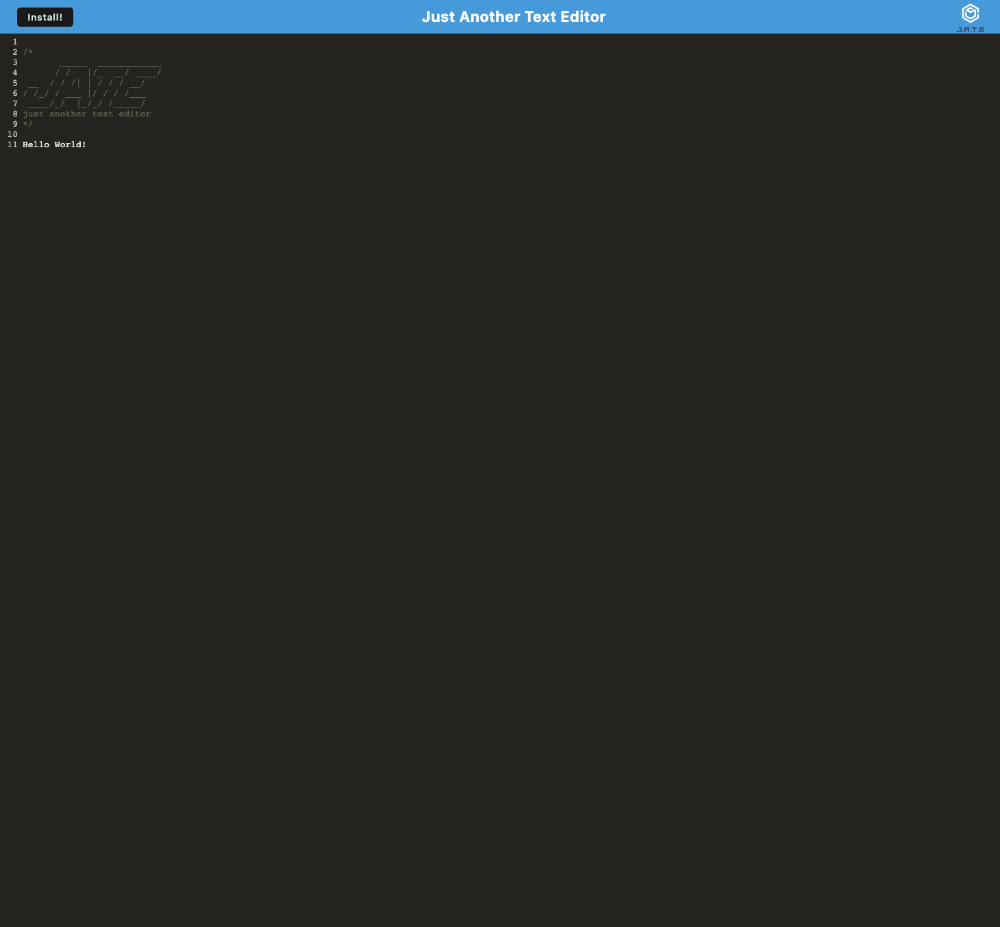

# Text Editor

<p> 
    
    
    
    
    
</p>


## Table of Contents
1. [Description](#description)
2. [User Story](#user-story)
3. [Screenshot](#screenshot)
4. [Heroku](#heroku)
5. [Installation](#installation)
6. [License](#license)
7. [Contributing](#contributing)
8. [Test](#test)
9. [Questions](#contact-information)

## Description
To build a text editor that runs in the browser. The app will be a single-page application that meets the PWA criteria. Additionally, it will feature a number of data persistence techniques that serve as redundancy in case on of the options is not supported by the browser. The application will also function offline. 

## User Story
```md
AS A developer
I WANT to create notes or code snippets with or without an internet connection
SO THAT I can reliably retrieve them for later use
```

## Heroku
Please view the live application [here](https://shelldan-text-editor.herokuapp.com/)

## Screenshot



## Installation
To clone the repo:
```
git clone https://github.com/shelldan/text-editor.git
``` 
Run 'npm install' to install dependencies

Run 'npm run start:dev' to start the program

---

## License
[](https://opensource.org/licenses/MIT) 

## Contributing 
To contribute to this application, create a pull request.
Here are the steps needed for doing that:
- Fork the repo
- Create a feature branch (git checkout -b NAME-HERE)
- Commit your new feature (git commit -m 'Add some feature')
- Push your branch (git push)
- Create a new Pull Request

Following a code review, your feature will be merged.

---

## Test:
It is recommended that you follow this workflow: 

```
GIVEN a text editor web application
WHEN I open my application in my editor
THEN I should see a client server folder structure
WHEN I run `npm run start` from the root directory
THEN I find that my application should start up the backend and serve the client
WHEN I run the text editor application from my terminal
THEN I find that my JavaScript files have been bundled using webpack
WHEN I run my webpack plugins
THEN I find that I have a generated HTML file, service worker, and a manifest file
WHEN I use next-gen JavaScript in my application
THEN I find that the text editor still functions in the browser without errors
WHEN I open the text editor
THEN I find that IndexedDB has immediately created a database storage
WHEN I enter content and subsequently click off of the DOM window
THEN I find that the content in the text editor has been saved with IndexedDB
WHEN I reopen the text editor after closing it
THEN I find that the content in the text editor has been retrieved from our IndexedDB
WHEN I click on the Install button
THEN I download my web application as an icon on my desktop
WHEN I load my web application
THEN I should have a registered service worker using workbox
WHEN I register a service worker
THEN I should have my static assets pre cached upon loading along with subsequent pages and static assets
WHEN I deploy to Heroku
THEN I should have proper build scripts for a webpack application
```

---

## Contact Information
* GitHub Username: [shelldan](https://github.com/shelldan)
